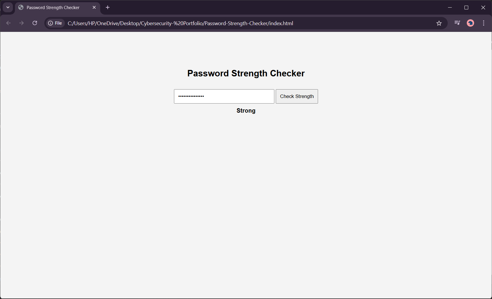

# Password Strength Checker

This project checks the strength of a password entered by the user.

## Features
- Checks password length
- Detects uppercase letters
- Detects numbers
- Detects special characters
- Shows Weak / Medium / Strong result

## Technologies Used
- HTML
- CSS
- JavaScript

## Screenshot
